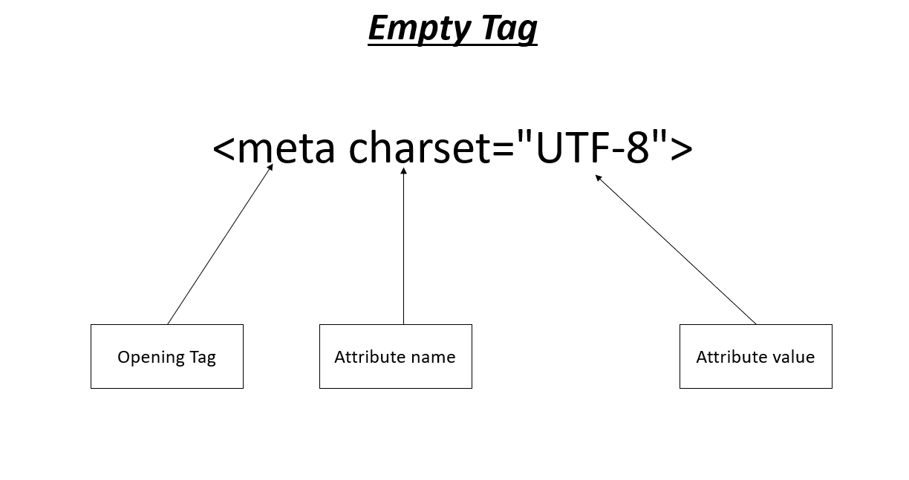

# HTML Documentation

## Tag Theory
Html is builded with Tag.<br/>
Tag is divided into two catagories:
<ul>
<li>Container Tag
<li>Empty Tag
</ul>

### Container Tag
Container tag has 
<ul>
<li>Opening Tag
<li>Closing Tag
<li>Content
<li>Attribute
</ul>


### Empty Tag
Empty tag has 
<ul>
<li>Opening Tag
<li>Attribute
</ul>


## HTML Basic Structure
```html
<!DOCTYPE html>
<html>
    <head>
        <meta charset="UTF-8">
        <meta name="viewport" content="width=device-width, initial-scale=1.0">
        <title></title>
        <style></style>
        <script src=""></script>
        <link rel="" href="">
    </head>

    <body>

        <!-- code here-->


        <script src=""></script>

        <script>
            <!-- javascript code here (Optional)-->
        </script>
    </body>
</html>
```

## Structure Tag

### Container Tag

<ul> 
<li>html
<li>head
<li>body
<li>title
<li>style
<li>script
</ul>

### Empty Tag
<ul> 
<li>meta
<li>link
</ul>

```html
<html> </html>      <!-- Everything inside the page must be inside this tag -->
<head> </head>      <!-- Stores page information (not visible on screen) -->
<body> </body>      <!-- Contains everything that is visible on the webpage -->
<title> </title>    <!-- Sets the browser tab title -->
<style> </style>    <!-- Used to write internel CSS inside the HTML file -->
<script> </script>  <!-- Connection between javascript and html file -->
<link>              <!-- Links external files -->
<meta>              <!-- Provides metadata information about the webpage -->
```
<b>File: </b><mark>Not given</mark>


## Body Tag
### Container Tag

<ul>
<li>h1 to h6
<li>p
<li>pre
<li>address
<li>details
<li>summary
<li>abbr
<li>b
<li>i
<li>u
<li>del
<li>mark
<li>sub
<li>sup
</ul>

### Empty Tag

<ul>
<li>br
<li>hr
</ul>

```html
<h1></h1> to <h6></h6>  <!-- Used for titles and sub-titles -->   
<p></p>                 <!-- Used for normal text content --> 
<pre></pre>             <!-- Keeps spaces, tabs, line breaks exactly as typed --> 
<address></address>     <!-- Contact information.Usually address, email, phone --> 
<details></details>     <!-- Hidden content that user can opens --> 
<summary></summary>     <!-- The visible title/heading for <details> --> 
<abbr title="full form here"></abbr>        <!-- Often used with title to show full form on hover --> 
<b></b>                 <!-- Bold text --> 
<i></i>                 <!-- Italic text --> 
<u></u>                 <!-- Underlined text --> 
<del></del>             <!-- usually shown with a line through text --> 
<mark></mark>           <!-- Highlighted text -->  
<sub></sub>             <!-- down-small text --> 
<sup></sup>             <!-- up-small text --> 
<br>                    <!-- Line break --> 
<hr>                    <!-- Horizontal line --> 
```
<b>File: </b><mark>Body_Tag.html</mark>

## Entity Syntax and Emoj

<b>File: </b><mark>Entity_Tag.html</mark>

## List Tag

### Unordered List
<ul>
<li>ul
<li>li
</ul>

### Ordered List
<ul>
<li>ol
<li>li
</ul>

### Description List
<ul>
<li>dl
<li>dt
<li>dd
</ul>
</ul>

```html
<ul type=""> </ul>  <!-- Unordered list (bullets) -->
<ol reversed type="" start=""> </ol>  <!-- Ordered list (numbered) -->
<li> </li>  <!-- List item -->
<dl> </dl>  <!-- Description list -->
<dt> </dt>  <!-- Definition title -->
<dd> </dd>  <!-- Definition description -->
```
<b>File: </b><mark>List_Tag.html</mark>

## Embed Tag

### Container Tag

<ul>
<li>audio
<li>video
<li>a
<li>iframe
</ul>

### Empty Tag

<ul>
<li>img
<li>source
</ul>

```html
      <!-- Add image -->
<audio controls loop autoplay muted> </audio>    <!-- Add Audio -->
<video width="" height="" controls loop autoplay muted poster="thumbnail"> </video>    <!-- Add Video -->
<source src="" type="video,audio/mp4,mp3">      <!-- Source file for audio/video -->
<a href="source" target="_blank" title="however text"> </a>     <!-- links (to pages, files, sections) -->
<iframe src=""> </iframe>  <!-- Embeds another page (YouTube, map, other site) -->
```
<b>File: </b><mark>Embed->Embed_Tag.html</mark>

## Semantic and Non-Semantic Tag

### Non-Semantic Tag
<ul>
<li>div
<li>span
</ul>

### Semantic Tag

<ul>
<li>header
<li>nav
<li>main
<li>section
<li>article
<li>aside
<li>footer
</ul>

```html
<div> </div>            <!-- Generic block container -->
<span> </span>          <!-- Generic inline container -->
<header> </header>      <!-- Top section: logo, title, header of page/section -->
<nav> </nav>            <!-- Navigation menu -->
<main> </main>          <!-- Main content of the page -->
<section> </section>    <!-- Thematic section of content with a heading -->
<article> </article>    <!-- Independent content: blog post, news, card -->
<aside> </aside>        <!-- Side content: sidebar, ads, related links/info -->
<footer> </footer>      <!-- Bottom section: copyright, contacts, footer -->
```
<b>File: </b><mark>Semantic and Non Semantic->sen_and_non_sem.html</mark>

## Table Tag
<ul>
<li>table
<li>caption
<li>thead
<li>tr
<li>th
<li>tbody
<li>td
<li>tfoot
</ul>

```html
<table> </table>        <!-- Creates a table -->
<caption> </caption>    <!-- Title of the table -->
<thead> </thead>        <!-- Header section of the table -->
<tr> </tr>              <!-- Table row -->
<th> </th>              <!-- Header cell (bold/centered by default) -->
<tbody> </tbody>        <!-- Main body content of the table -->
<td> </td>              <!-- Data cell -->
<tfoot> </tfoot>        <!-- Footer section of the table (summary/totals) -->
```

<b>File: </b><mark>Table_Tag.html</mark>

## Form Tag


### Container Tag

<ul>
<li>form
<li>legend
<li>fieldset
<li>label
<li>button
<li>textarea
<li>select
<li>datalist
<li>option
<li>optgroup

</ul>

### Empty Tag

<ul>
<li>input
</ul>

```html
<form> </form>              <!-- Form container -->
<fieldset> </fieldset>      <!-- Border Line into form -->
<legend> </legend>          <!-- Caption/title -->
<label> <label>             <!-- Label for input -->
<button> </button>          <!-- Clickable button -->
<textarea> </textarea>      <!-- Multi-line text input field -->
<select name=""> </select>          <!-- Dropdown list -->
<option value=""> </option>          <!-- Item inside <select> or <datalist> -->
<optgroup label=""> </optgroup>      <!-- Group related options inside <select> -->
<input type="" name="" id="">                     <!-- Single-line input (text, email, password, etc.) -->
<datalist id=""> </datalist>      <!-- Provides autocomplete suggestions for input -->
```

<b>File: </b><mark>Form_Tag.html</mark>